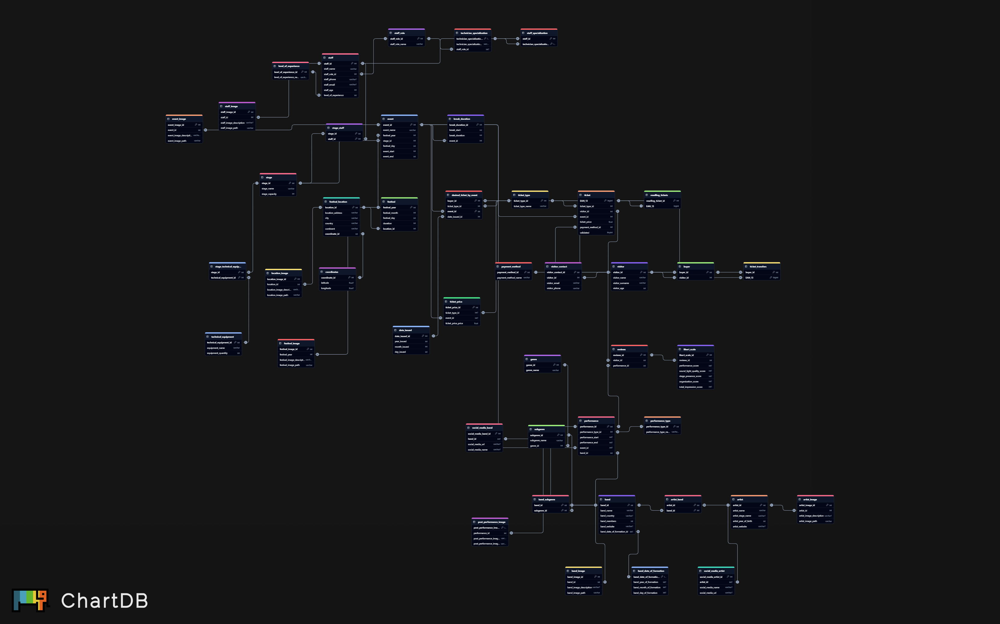

# **International Music Festival of Pulse University Database**

This project manages all data for Pulse University's annual music festival, including artist lineups, stage schedules, ticket sales, equipment logistics, and performance ratings. The database is designed to streamline every aspect of festival operations - from visitor reviews to coordinating staff assignments across multiple venues.

## **Table of Contents**
- Features
- Database Schema
- Installation
- Usage
- Contributing
- License

## **Directory Features**
 - Database Management:
        MariaDB-powered: Scalable and robust storage for contest data.
        Automated workflows: Triggers and stored procedures for seamless operations.

 - Data Generation: 
        *Dummy Data was generated with the help of LLMs and Python Scripts*
 
  Core Modules:
        Events: Track the Stages, Performances, Bands and Staff of the Event
        Visitors: Store visitors' profiles
        Artists: Store artist's profiles
        Staff and Equipment Management: Store required staff and equipment info 
        Rating Systems: Automate score calculations and leaderboard
        Reselling ticket application: Automate the reselling of tickets for the event

## **Database Scema**
### Entity Related Diagram


### Relational Schema



*link to the diagram folder: https://github.com/VasilisIoannou/DatabaseNTUA/tree/main/diagrams*

## **Installation**  
Steps to install the project:  

1. Clone the repo: 

```
    git clone https://github.com/VasilisIoannou/DatabaseNTUA
    cd DatabaseNTUA
```
<br>
2. Set up MariaDB:


```
    mysql -u root -p < install.sql
```
<br>
3. Generate dummy data:
<br>

```
    mysql -u root -p festivalDB < load.sql
```

4. Test Query:

```
    mysql -u root -p festivalDB < Q01.sql
```
Note: Some test Queries are in the folder ./sql/Query


## Usage Examples:

- Query Artist By Age:
```  
    SELECT * FROM artist WHERE artist_age < 35;
```
- Add a New festival:

```
    INSERT INTO festival (festival_year, festival_month, festival_day, duration, location_id) VALUES (2030, 10, 20, 5, 10);
```
<br>
<div>
    The above will create an instance of the festival starting 20/10/2030 (DD/MM/YYYY) until 25/10/2030
    Note: For the Instance of the Festival to be created the instance of location/coordinates must already exist.
</div>

## **Acknowledgements** 
Participants: 
<div> Vasilis Ioannou </div> 
<div> Dimitris Markidis </div>
<div> Theodoros Tsakalos </div>

